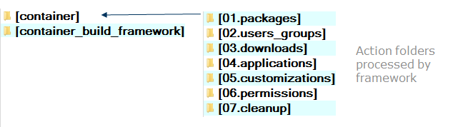

# Framework for Building Containers

## Action Folders

 

#### Environment
Every script defined in the action folders, is run from the '/tmp' folder as the current directory.
The following environment variables are available:

Environment Variable | contents
--- | ---
 CBF['base'] | base folder. In the build container, this is '/tmp'. In the git workspace, this is the 'build' folder.
 CBF['action'] | actions folder. This contains the folders over which the framework iterates.
 CBF['lib'] | cbf library folder. This contains the framework bashlib scripts.
 CBF['templates'] | action template folders. This is the framework copy of the `action_folders`
 
These environment variables may be used to source any of the scripts in the action folders using "${CBF['action']}" or from the `action_folders` directories using "${CBF['action']}".
Any script language may be used in the any of the `action_folders', other than *02.users_groups* and *03.downloads*.

### Install needed OS Support
**Folder:** _01.packages_

This folder contains scripts and/or symbolic links which contain commands to install OS functionality. On Alpine Linux, these files contain `apk add` commands. Example:
```bash
# core Packages
apk add --no-cache bash-completion coreutils openssh-client shadow supervisor sudo ttf-dejavu unzip 
```


### Verify users and groups exist
**Folder:** _02.users_groups_

This folder contains scripts definitions for users and groups to configure inside the container. After stripping off any prefix digits, the name (by convention) should be the same as the associative array declared by the file. All of these array definitions should allways be lowercase to prevent name conflicts with ##Downloads## The mandatory fields are
- user
- uid
- group
- gid

`shell` and `home` are optional fields. 

Example *01.hubot* file:
```bash
# Hubot
declare -A hubot=()
declare bht_uid=${hubot_uid:-2223}
declare bht_gid=${hubot_gid:-2223}
hubot['user']=${HUBOT_USER:-hubot}
hubot['uid']=${bht_uid:-$(getent passwd "${hubot['user']}" | cut -d: -f3)}
hubot['group']=${HUBOT_GROUP:-hubot}
hubot['gid']=${bht_gid:-$(getent group "${hubot['user']}" | cut -d: -f3)}
hubot['shell']=/bin/bash
hubot['home']="${HUBOT_HOME:-/usr/local/hubot}"
# other directories
export HUBOT_HOME="${hubot['home']}" 
```
These files may be 'sourced' in later scripts to access their definitions.


### Download & verify external packages
**Folder:** _03.downloads_

This folder contains scripts definitions for files which should be downloaded. After stripping off any prefix digits, the name (by convention) should be the same as the associative array declared by the file.
The mandatory fields are
- file
- url
- sha256

Every other declaration is optional. 
Example of 01.PHPADMIN file:

```bash
# PHPADMIN
declare -A PHPADMIN=()
PHPADMIN['version']=${PHPADMIN_VERSION:-4.7.4}
PHPADMIN['file']="/tmp/phpMyAdmin-${PHPADMIN['version']}-all-languages.tar.gz"
PHPADMIN['url']="https://files.phpmyadmin.net/phpMyAdmin/${PHPADMIN['version']}/phpMyAdmin-${PHPADMIN['version']}-all-languages.tar.gz"
PHPADMIN['sha256']="fd1a92959553f5d87b3a2163a26b62d6314309096e1ee5e89646050457430fd2"
export WWW=/www  
```
The file gets downloaded and saved to the specified file. The sha256 is compared against that calculated from the downloaded file, and if it is the same, the download is considered successful. A max of three retries is performed. The file should be downloaded and the sha256 calculated ahead of building your container. In Linux, the `sha256sum` application can be used. These file may be 'sourced' in later scripts to access their definitions.


### Install applications
**Folder:** _04.applications_

This folder contains scripts which should perform the installation of the major functionality. One script should be used per application installation. Example application installation script:
```bash
#!/bin/bash
# Gradle installation script
source "${CBF['lib']}/term.sh"
source "${CBF['action']}/04.downloads/01.GRADLE" 
mkdir -p /opt
cd /opt
unzip "${GRADLE['file']}"
ln -s "/opt/gradle-${GRADLE['version']}/bin/gradle" /usr/bin/gradle
declare dot_gradle="${GRADLE['home']}/.gradle"
mkdir -p "$dot_gradle"
chown -R gradle:gradle "${GRADLE['home']}"
ln -s "$dot_gradle" /root/.gradle
$LOG "Testing Gradle installation${LF}" 'info'
/usr/bin/gradle --version
printf "%s\n" ${GRADLE[@]}
```

### Add customizations and configuration
**Folder:** _05.customizations_

This folder contains scripts  which customize what has been setup so far. A symbolic link to the the script `01.custom_folders` is located in this folder. It copies the content of the custom folders is located. I
```bash
#!/bin/bash
# 01.custom_folders: copy contents of custme folders from /tmp into the root of the container
declare -r tools=/tmp
declare -r dirs='bin etc home lib lib64 media mnt opt root sbin usr var'
for dir in ${dirs} ; do
    [ -d "${tools}/${dir}" ] && cp -r "${tools}/${dir}/"* "/${dir}/"
done
true 
```

### Make sure that ownership & permissions are correct
**Folder:** _06.permissions_

This folder contains scripts which setup file ownership and permissions.

```bash
#!/bin/bash
if [ -f /usr/local/bin/docker-entrypoint.sh ]; then
    chmod u+rwx /usr/local/bin/docker-entrypoint.sh
    [ -h /docker-entrypoint.sh ] || ln -s /usr/local/bin/docker-entrypoint.sh /docker-entrypoint.sh 
fi
```1

### Clean up 
**Folder:** _07.cleanup_

This folder contains scripts which cleanup content which is outside of the /tmp folder. A symbolic link to the 99.apk.cleanup script is located here.
```bash
#!/bin/bash
source "${CBF['lib']}/cbf.bashlib"
apk del .build-deps
declare -r cacheDir=/var/cache/apk
declare -a files=( $( lib.getFiles "${cacheDir}" ) )
if [ ${#files[*]} -gt 0 ]; then
    rm -rf "$cacheDir"/*
fi 
```


**************

## Introduction & Installation
- [Introduction](../README.md)
- [Installation](./Installation.md)

